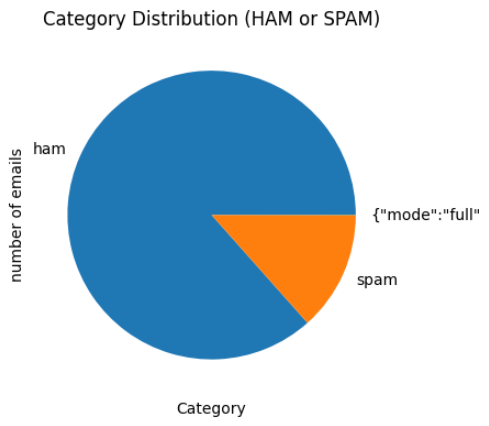

# 📧 Spam Mail Detection API

A FastAPI-based project to detect spam emails using machine learning. This repository includes everything from training to deploying a REST API powered by a trained model.

---

## 🚀 Getting Started

### Requirements

* Python 3.8+ | dev --version: Python 3.13
* pip

### Installation

```bash
pip install -r requirements.txt
```

### Running the API

```bash
uvicorn app:app --reload
```

Or using the `Procfile` (e.g., for Heroku):

```bash
web: uvicorn app:app --host=0.0.0.0 --port=${PORT:-8000}
```

---

## 📊 Dataset Overview

* Dataset file: `email.csv`

* Contains real-world email examples labeled as `ham` or `spam`

* Mapping used in preprocessing:

  ```python
  df["Category"] = df["Category"].map({"ham": 0, "spam": 1})
  ```

* Total records: **\[ADD\_TOTAL\_RECORDS]**

  * 🟢 Ham: **\[ADD\_HAM\_COUNT]**
  * 🔴 Spam: **\[ADD\_SPAM\_COUNT]**

### 📈 Data Distribution



> Replace this image path with your actual chart at `docs/spam_pie_chart.png`

---

## 🧐 Model Information

* Training notebook: `Spam Email Detection Machine Learning Train Script.ipynb`
* Saved models:

  * `models/spam_model.pkl`
  * `models/tfidf_vectorizer.pkl`

---

## 🔮 API Usage

### Endpoint: `POST /predict`

#### Request:

```json
{
  "text": "Congratulations! You've won a free iPhone. Click here to claim."
}

```

#### Response:

```json
{
  "prediction": "spam"
}
```

---

## 📃 Notebooks

* `notebooks/Api Example.ipynb`: Example API interactions
* `notebooks/Spam Email Detection Machine Learning Train Script.ipynb`: Model training and evaluation

---

## 📁 File Structure

```
.
├── app.py
├── requirements.txt
├── requirements.lock.txt
├── Dockerfile
├── docker-compose.yml
├── AUTHOR
├── data/
│   └── email.csv
├── models/
│   ├── spam_model.pkl
│   └── tfidf_vectorizer.pkl
├── notebooks/
│   ├── Api Example.ipynb
│   └── Spam Email Detection Machine Learning Train Script.ipynb
└── docs/
    └── spam_pie_chart.png
    └── avatar.png
```

---

## 📢 License

GNU Affero General Public License v3.0


## Faruk şeker | Code ninja
---
